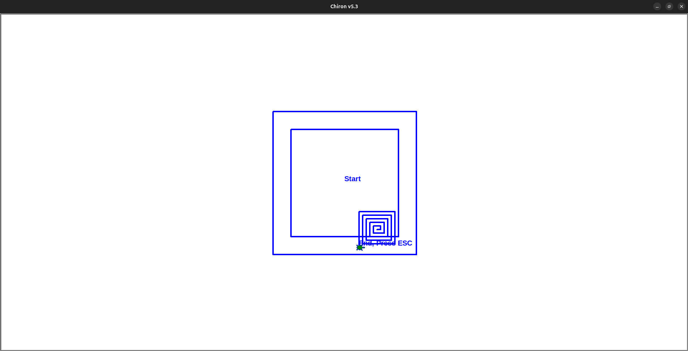
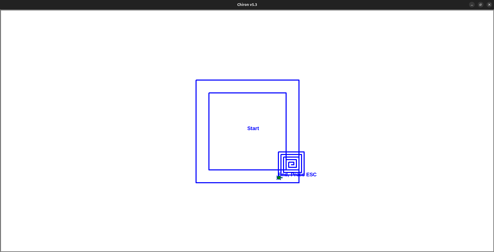

# Description
ProofEngine is tool for program verification built upon the chiron framework. It allows the user to add analysis statements in the source code for deductive verification. It takes the analysis source code as input and generates a SMTLIB code, which is then checked for satisfiabilty using an integrated Z3 Solver. 

# Examples
## Example1
Consider a toy program which checks if the cubic identity \((a-b)<sup>3</sup> = a<sup>3</sup> - 3a<sup>2</sup>b + 3ab<sup>2</sup> - b<sup>3</sup>\) is correct (`./examples/cube.tl`)

```
assume(1==1)
:c1 = :a*:a*:a - 3*:a*:a*:b + 3*:a*:b*:b - :b*:b*:b
:c2 = (:a-:b)*(:a-:b)*(:a-:b)
assert(:c1 == :c2)
```
Use the `-smt\--smtlib` flag for running ProofEngine

```bash
python3 chiron.py -smt ./examples/cube.tl
python3 chiron.py --smtlib ./examples/cube.tl
```
The output should looks like this
```stdout
======Z3 Output:======

Condition verified :)
```

Let us introduce a bug (`./examples/cube_buggy.tl)
```
assume(1==1)
:c1 = :a*:a*:a - 3*:a*:a*:b - 3*:a*:b*:b + :b*:b*:b
:c2 = (:a-:b)*(:a-:b)*(:a-:b)
assert(:c1 == :c2)
```

Use the `-smt\--smtlib` flag for running ProofEngine

```bash
python3 chiron.py -smt ./examples/cube_buggy.tl
python3 chiron.py --smtlib ./examples/cube_buggy.tl
```
The output should looks like this
```stdout
======Z3 Output:======

Condition verification failed :(
Counterexample:
a_0_0 : -1
c2_0_1 : -8
c1_0_1 : 0
b_0_0 : 1

Please refer to "control_flow_graph.png" for variable names.
```
Not only we see that the verification fails, but we also get the set of values for which the program will fail.

## Example2
Consider a program for sum of an arithmetic progression 
```
:s = 0
:i = :a
repeat :n [
    :s = :s + :i
    :i = :i + :d
]
```
We want to prove that the program is correct. For programs with a loop, we need to provide an invariant of the loop. We can insert analysis code as follows -
```
assume(:s==0 && :i==:a)
repeat :n [
    invariant(:s == (((:n-:REPCOUNTER)*(2*:a + (:n-:REPCOUNTER-1)*:d))/2) && (:i == :a + (:n-:REPCOUNTER)*:d) )
    :s = :s + :i
    :i = :i + :d
]
assert(:s == ((:n*(2*:a + (:n-1)*:d))/2))
``` 
This test case is present in `./examples/arithmetic_progression.tl`.

```bash
python3 chiron.py -smt ./examples/arithmetic_progression.tl
python3 chiron.py --smtlib ./examples/arithmetic_progression.tl
```
The output should looks like this
```stdout
======Z3 Output:======

Initialization Condition verified :)

Loop Condition verified :)

Final Condition verified :)
```
If there is a bug in the code, output will show which condition failed and also the list of values for which the condition fails.
```stdout
======Z3 Output:======

Initialization Condition verified :)

Loop Condition verified :)

Final Condition verification failed :(
Counterexample:
<list of {varible : value} pairs>
```

## Example3
We can also use it for more complicated programs which use the turtle commands. For example, we can prove iff the turtle starts in the inner box, it will not step outside the outer box (see `home.tl` for analysis code and `home_src.tl` for source code)-

<!-- Add Screenshots here -->
<!--  -->
<div style="width: 500px; height: 500px; overflow: hidden;">
  
</div>

<div style="width: 500px; height: 500px; overflow: hidden;">
  
</div>

<br>

**Please refer to `./examples/` directory for more interesting testcases.**

# Use Cases
1. **Proving program correctness :** We can use ProofEngine to prove that a program is correct or that a program shows a certain behaviour/property by inserting suitable analysis code.
2. **Finding bugs :** If a program is incorrect, we can find a counterexample to prove that the program is incorrect.
3. **Proving two programs are equivalent :** We can write the analysis code suitably to prove that two programs always behave the same. See `./examples/leapyear.tl` for example testcase.
4. **Proving correctness for unbounded loops :** Since ProofEngine utilizes __invariant__, we can do deductive verification and prove correctness for unbounded loops, i.e.,conditions like P is true &forall; n can be proven.

# Other Details
For writing the constraints on the turtle's state, following variables are reserved, which the user can use - 

- TURTLEX : for turtle's x-coordinate
- TURTLEY : for turtle's y-coordinate
- TURTLEANGLE : for turtle's angle of direction
- TURTLEPEN : for turtle's penstatus (0 for pendown, 1 for penup)

For loops, repcounter, REPCOUNTER can be used.

