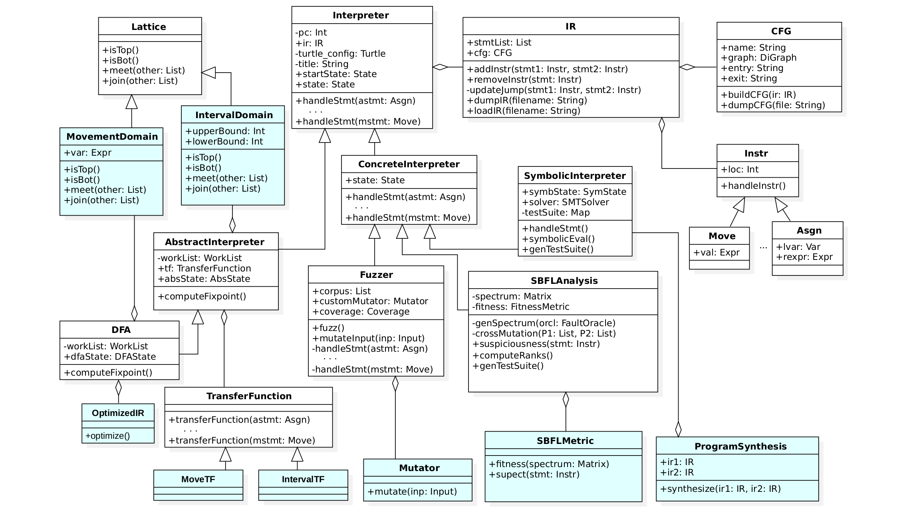

# Program Analysis with Chiron

A framework to teach program analysis, verification, and testing in a graduate-level course.

```
░█████╗░██╗░░██╗██╗██████╗░░█████╗░███╗░░██╗
██╔══██╗██║░░██║██║██╔══██╗██╔══██╗████╗░██║
██║░░╚═╝███████║██║██████╔╝██║░░██║██╔██╗██║
██║░░██╗██╔══██║██║██╔══██╗██║░░██║██║╚████║
╚█████╔╝██║░░██║██║██║░░██║╚█████╔╝██║░╚███║
░╚════╝░╚═╝░░╚═╝╚═╝╚═╝░░╚═╝░╚════╝░╚═╝░░╚══╝
```
[](./assets/Architecture_Digram.png)
[![Watch the video]](https://github.com/PRAISE-group/Chiron-Framework/blob/master/assets/Fuzzer_Demo.mp4)

### Installing Dependencies

```bash
pip install antlr4-python3-runtime==4.7.2
pip install networkx
pip install z3-solver numpy
sudo apt-get install python3-tk
```

### Generating the ANTLR files.

```
cd ChironCore/turtparse
java -cp ../extlib/antlr-4.7.2-complete.jar org.antlr.v4.Tool \
  -Dlanguage=Python3 -visitor -no-listener tlang.g4
```

### Running an example

The main directory for source files is `ChironCore`. We have examples of the turtle programs in `examples` folder.

```bash
$ cd ChironCore
$ ./chiron.py -r ./example/example1.tl
```

### See help for other command line options

```bash
$ python3 chiron.py --help


░█████╗░██╗░░██╗██╗██████╗░░█████╗░███╗░░██╗
██╔══██╗██║░░██║██║██╔══██╗██╔══██╗████╗░██║
██║░░╚═╝███████║██║██████╔╝██║░░██║██╔██╗██║
██║░░██╗██╔══██║██║██╔══██╗██║░░██║██║╚████║
╚█████╔╝██║░░██║██║██║░░██║╚█████╔╝██║░╚███║
░╚════╝░╚═╝░░╚═╝╚═╝╚═╝░░╚═╝░╚════╝░╚═╝░░╚══╝


Chiron v1.0.1
------------
usage: chiron.py [-h] [-p] [-r] [-gr] [-b] [-z] [-t TIMEOUT] [-d PARAMS] [-c CONSTPARAMS] [-se] [-ai] [-dfa] [-sbfl]
                 [-bg BUGGY] [-vars INPUTVARSLIST] [-nt NTESTS] [-pop POPSIZE] [-cp CXPB] [-mp MUTPB] [-ng NGEN]
                 [-vb VERBOSE]
                 progfl

Program Analysis Framework for ChironLang Programs.

positional arguments:
  progfl

options:
  -h, --help            show this help message and exit
  -p, --ir              pretty printing the IR of a Chiron program to stdout (terminal)
  -r, --run             execute Chiron program, the figure/shapes the turle draws is shown in a UI.
  -gr, --fuzzer_gen_rand
                        Generate random input seeds for the fuzzer before fuzzing starts.
  -b, --bin             load binary IR of a Chiron program
  -z, --fuzz            Run fuzzer on a Chiron program (seed values with '-d' or '--params' flag needed.)
  -t TIMEOUT, --timeout TIMEOUT
                        Timeout Parameter for Analysis (in secs). This is the total timeout.
  -d PARAMS, --params PARAMS
                        pass variable values to Chiron program in python dictionary format
  -c CONSTPARAMS, --constparams CONSTPARAMS
                        pass variable(for which you have to find values using circuit equivalence) values to Chiron program
                        in python dictionary format
  -se, --symbolicExecution
                        Run Symbolic Execution on a Chiron program (seed values with '-d' or '--params' flag needed) to
                        generate test cases along all possible paths.
  -ai, --abstractInterpretation
                        Run abstract interpretation on a Chiron Program.
  -dfa, --dataFlowAnalysis
                        Run data flow analysis using worklist algorithm on a Chiron Program.
  -sbfl, --SBFL         Run Spectrum-basedFault localizer on Chiron program
  -bg BUGGY, --buggy BUGGY
                        buggy Chiron program path
  -vars INPUTVARSLIST, --inputVarsList INPUTVARSLIST
                        A list of input variables of given Chiron program
  -nt NTESTS, --ntests NTESTS
                        number of tests to generate
  -pop POPSIZE, --popsize POPSIZE
                        population size for Genetic Algorithm.
  -cp CXPB, --cxpb CXPB
                        cross-over probability
  -mp MUTPB, --mutpb MUTPB
                        mutation probability
  -ng NGEN, --ngen NGEN
                        number of times Genetic Algorithm iterates
  -vb VERBOSE, --verbose VERBOSE
                        To display computation to Console

```
